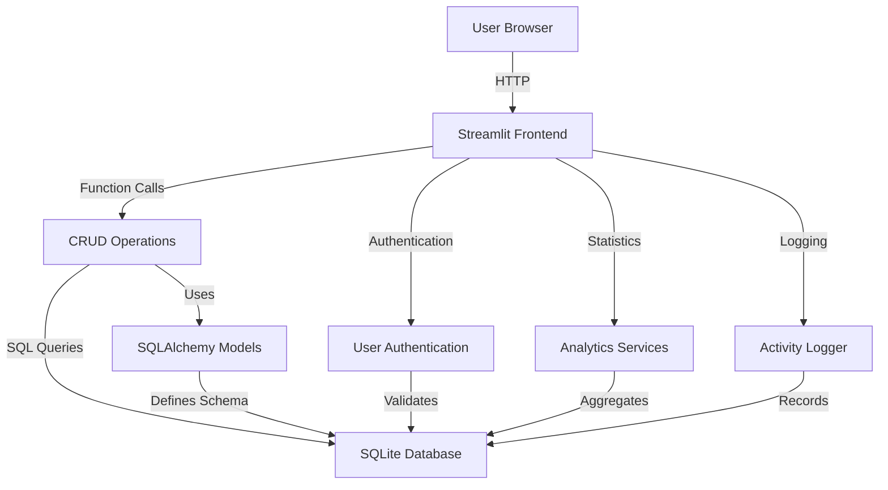

# Lead Manager - Complete System Flow

## 🏗️ System Architecture



## 📁 Project Structure

```
lead_manager/
├── app/
│   ├── __init__.py          # Package marker
│   ├── db.py                # Database connection & session
│   ├── models.py            # SQLAlchemy models (User, Lead, Event, ActivityLog)
│   ├── schemas.py           # Pydantic validation schemas
│   ├── crud_users.py        # User CRUD & authentication
│   ├── crud_leads.py        # Lead CRUD operations
│   ├── crud_events.py       # Event CRUD operations
│   ├── crud_activity_logs.py # Activity Logging operations
│   └── services_stats.py    # Analytics & statistics
├── tests/
│   ├── __init__.py
│   └── test_basic.py        # Pytest tests
├── streamlit_app.py         # Web UI application
├── create_db.py             # Database initialization
├── leads.db                 # SQLite database file
└── .venv/                   # Virtual environment
```

## 🔄 Complete Data Flow

### 1️⃣ **Application Startup**

```
User runs: streamlit run streamlit_app.py
    ↓
Streamlit loads streamlit_app.py
    ↓
Imports app modules (db, models, crud, stats)
    ↓
Displays Login Page
```

### 2️⃣ **Authentication Flow**

```
User enters credentials → Streamlit form
    ↓
Form submission triggers authentication
    ↓
crud_users.authenticate_user(db, username, password)
    ↓
Query database for user: SELECT * FROM users WHERE username = ?
    ↓
Verify password using bcrypt: verify_password(plain, hashed)
    ↓
Check if user is approved (is_approved=True)
    ↓
If valid → Set session_state.authenticated = True
    ↓
Log Login Activity (ActivityLog)
    ↓
Redirect to Dashboard
```

### 3️⃣ **Dashboard Flow**

```
Authenticated user → Dashboard view
    ↓
services_stats.get_basic_counts(db)
    ↓
Query: SELECT COUNT(*) FROM leads
Query: SELECT COUNT(*) FROM users
    ↓
Display statistics in Streamlit cards
    ↓
services_stats.leads_by_staff(db)
    ↓
Query: SELECT staff_name, COUNT(id) FROM leads GROUP BY staff_name
    ↓
Render bar chart with pandas/altair
```

### 4️⃣ **View Leads Flow**

```
User clicks "View Leads" → Streamlit navigation
    ↓
crud_leads.list_leads(db, limit=100)
    ↓
Query: SELECT * FROM leads ORDER BY created_at DESC LIMIT 100
    ↓
Apply filters (name, staff, source, status) in Python
    ↓
Display each lead in expandable st.expander()
    ↓
Show Edit, Delete, History & Referral buttons
```

### 5️⃣ **Activity Logging Flow**

```
User performs action (e.g., Update Lead)
    ↓
crud_leads.update_lead() called
    ↓
Update performed in DB
    ↓
crud_activity_logs.create_activity_log() called
    ↓
Record: User, Action Type, Entity, Changes (Old/New values)
    ↓
INSERT INTO activity_logs ...
```

### 6️⃣ **Referral Management Flow**

```
User clicks "Mark Referral"
    ↓
Select Type: "Regular" or "Interim"
    ↓
Update Lead: active_client=True, referral_type=Type
    ↓
Log Activity: "Marked as Referral"
    ↓
UI Updates to show "Referral" status
```

## 🗄️ Database Schema

### **Users Table**
```sql
CREATE TABLE users (
    id INTEGER PRIMARY KEY,
    username VARCHAR(100) UNIQUE NOT NULL,
    email VARCHAR(255) UNIQUE NOT NULL,
    hashed_password VARCHAR(255) NOT NULL,
    role VARCHAR(50) NOT NULL DEFAULT 'user',
    is_approved BOOLEAN NOT NULL DEFAULT 0,
    password_reset_requested BOOLEAN NOT NULL DEFAULT 0,
    created_at DATETIME NOT NULL
);
```

### **Leads Table**
```sql
CREATE TABLE leads (
    id INTEGER PRIMARY KEY,
    created_at DATETIME NOT NULL,
    updated_at DATETIME NOT NULL,
    created_by VARCHAR(100),
    updated_by VARCHAR(100),
    staff_name VARCHAR(150) NOT NULL,
    first_name VARCHAR(150) NOT NULL,
    last_name VARCHAR(150) NOT NULL,
    source VARCHAR(150) NOT NULL,
    event_name VARCHAR(150),
    word_of_mouth_type VARCHAR(50),
    other_source_type VARCHAR(150),
    active_client BOOLEAN NOT NULL DEFAULT 0,
    referral_type VARCHAR(50),
    phone VARCHAR(50) NOT NULL,
    city VARCHAR(100),
    zip_code VARCHAR(20),
    dob DATE,
    medicaid_no VARCHAR(100),
    e_contact_name VARCHAR(150),
    e_contact_relation VARCHAR(100),
    e_contact_phone VARCHAR(50),
    last_contact_status VARCHAR(50) NOT NULL DEFAULT 'Initial Call',
    last_contact_date DATETIME,
    comments TEXT
);
```

### **Events Table**
```sql
CREATE TABLE events (
    id INTEGER PRIMARY KEY,
    event_name VARCHAR(150) UNIQUE NOT NULL,
    created_at DATETIME NOT NULL,
    created_by VARCHAR(100) NOT NULL,
    updated_at DATETIME,
    updated_by VARCHAR(100)
);
```

### **Activity Logs Table**
```sql
CREATE TABLE activity_logs (
    id INTEGER PRIMARY KEY,
    timestamp DATETIME NOT NULL,
    user_id INTEGER,
    username VARCHAR(100) NOT NULL,
    action_type VARCHAR(50) NOT NULL,
    entity_type VARCHAR(50) NOT NULL,
    entity_id INTEGER,
    entity_name VARCHAR(200),
    description TEXT NOT NULL,
    old_value TEXT,
    new_value TEXT,
    keywords VARCHAR(200),
    ip_address VARCHAR(50)
);
```

## 🔐 Security & Validation

### **Password Security**
- Passwords hashed using **bcrypt** (via passlib)
- Never stored in plain text
- Salt automatically generated per password
- Verification via `verify_password()` function

### **Data Validation**
- **Pydantic schemas** validate all input data
- Type checking (str, int, bool, date, datetime)
- Required field enforcement
- Length constraints (`max_length`, `min_length`)
- Model conversion (`from_attributes=True`)

### **Session Management**
- Streamlit `session_state` stores authentication status
- `authenticated` flag controls access to pages
- `username` stored for display
- No sensitive data in session state

## 📊 Analytics Queries

### **Basic Counts**
```python
total_leads = db.query(models.Lead).count()
# SQL: SELECT COUNT(*) FROM leads
```

### **Leads by Staff**
```python
db.query(models.Lead.staff_name, func.count(models.Lead.id))
  .group_by(models.Lead.staff_name)
# SQL: SELECT staff_name, COUNT(id) FROM leads GROUP BY staff_name
```

### **Monthly Trends**
```python
db.query(func.strftime("%Y-%m", models.Lead.created_at), func.count(models.Lead.id))
  .group_by(func.strftime("%Y-%m", models.Lead.created_at))
# SQL: SELECT strftime('%Y-%m', created_at), COUNT(id) 
#      FROM leads GROUP BY strftime('%Y-%m', created_at)
```

## 🧪 Testing Flow

### **Backend Tests** (`test_backend.py`)
```
python test_backend.py
    ↓
Creates test user → Authenticates → Creates lead
    ↓
Tests CRUD operations (create, read, update, delete)
    ↓
Verifies database operations
```

### **Pytest Tests** (`tests/test_basic.py`)
```
pytest tests/test_basic.py
    ↓
test_user_create_and_auth: Creates user & verifies auth
test_lead_crud_and_stats: Full CRUD cycle + analytics
    ↓
Uses assertions to verify correctness
    ↓
Pass/Fail results
```

## 🚀 Deployment Flow

### **Development**
1. **Activate environment:** `source .venv/bin/activate`
2. **Run migrations:** `python create_db.py`
3. **Start Streamlit:** `streamlit run streamlit_app.py`
4. **Access:** http://localhost:8501

### **Production Considerations**
- Switch from SQLite to PostgreSQL/MySQL
- Add environment variables for configuration
- Implement proper logging
- Add data backup strategy
- Use production WSGI server
- Enable HTTPS
- Add rate limiting
- Implement audit logs

## 📋 Key Features

✅ **User Authentication** - Secure login with bcrypt, Admin Approval, Password Reset  
✅ **Lead Management** - Full CRUD operations, History Tracking  
✅ **Referral Management** - Mark/Unmark Referrals, Track Referral Types  
✅ **Dashboard Analytics** - Real-time statistics, Event & Word of Mouth tracking  
✅ **Activity Logging** - Comprehensive audit trail for all actions  
✅ **Search & Filter** - Find leads by name, staff, source, status  
✅ **Data Validation** - Pydantic schemas ensure data integrity  
✅ **Responsive UI** - Clean Streamlit interface  
✅ **Testing** - Comprehensive test coverage  

## 🛠️ Technology Stack

| Layer | Technology |
|-------|-----------|
| **Frontend** | Streamlit |
| **Backend** | Python 3.12 |
| **ORM** | SQLAlchemy |
| **Database** | SQLite |
| **Validation** | Pydantic |
| **Authentication** | passlib (bcrypt) |
| **Testing** | pytest |
| **Charts** | pandas, altair |

## 📈 Data Flow Summary

```
User Input (Browser)
    ↓
Streamlit UI Layer
    ↓
Pydantic Validation
    ↓
CRUD Operations
    ↓
SQLAlchemy ORM
    ↓
SQLite Database
    ↓
Returns Data
    ↓
Display in UI
```

---

**Login Credentials:**  
Username: `Safelife`  
Password: `123456`

**Run Application:**  
```bash
cd lead_manager
source .venv/bin/activate
streamlit run streamlit_app.py
```
